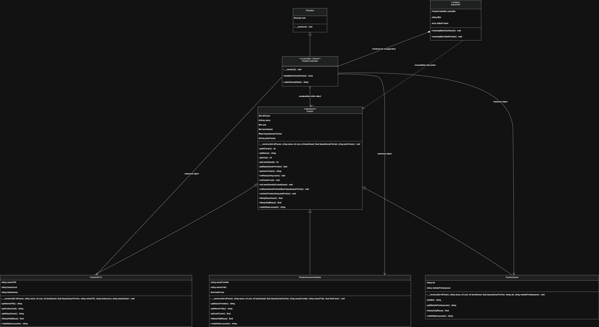

# Sistem Manajemen Layanan Medis & BPJS Rumah Sakit

Project ini dibuat untuk memenuhi tugas **Praktikum Pemrograman Berorientasi Objek (PBO)**. Sistem ini menggunakan **PHP OOP murni** dan terhubung dengan database **MySQL** untuk menampilkan data pasien rawat inap serta menghitung total biaya layanan berdasarkan jenis penjamin pasien.

Studi kasus yang digunakan adalah:

**Kasus B: Sistem Manajemen Layanan Medis & BPJS Rumah Sakit**

---

## Daftar Anggota Kelompok

| No | Nama Anggota |
|---|---|
| 1 | Ahmad Fakhri Abdullah |
| 2 | Astri Yuli Andani |
| 3 | Elang Panca Tunggal |
| 4 | Lutfi Mohammad Hafiz |
| 5 | Mukhamad Ferdiyanto |

---

## Deskripsi Singkat Sistem

Sistem ini digunakan untuk mengelola dan menampilkan data pasien rawat inap berdasarkan tiga jenis penjamin layanan, yaitu:

1. **Pasien BPJS**
2. **Pasien Asuransi Swasta**
3. **Pasien Umum / Mandiri**

Setiap jenis pasien memiliki aturan perhitungan biaya yang berbeda. Perbedaan perhitungan tersebut diterapkan menggunakan konsep **polymorphism** melalui method `hitungTotalBiaya()` yang dioverride pada setiap subclass.

---

## Teknologi yang Digunakan

- PHP
- MySQL
- phpMyAdmin
- HTML
- CSS
- Bootstrap
- GitHub

---

## Struktur Folder Project

```text
tugaskelompok-pbo/
│
├── models/
│   ├── pasien.php
│   ├── pasienBPJS.php
│   ├── pasienasuransiswasta.php
│   └── pasienumum.php
│
├── classDiagram.png
├── koneksi.php
├── pasien_RumahSakit.php
├── dbrumahsakit.sql
├── index.php
└── README.md
```

---

## Panduan Instalasi dan Menjalankan Aplikasi

### 1. Clone Repository

Clone repository dari GitHub menggunakan perintah berikut:

```bash
git clone link-repository-github-kelompok
```

Atau download repository dalam bentuk ZIP, lalu ekstrak folder project.

---

### 2. Pindahkan Folder Project ke Server Lokal

Letakkan folder project di dalam folder **Document Root** yang digunakan Laragon.

Jalankan aplikasi dapat melalui:

```text
http://localhost/index.php
```

---

### 3. Import Database

1. Buka **phpMyAdmin**.
2. Buat database baru dengan nama:

```text
dbrumahsakit
```

3. Import file database:

```text
dbrumahsakit.sql
```

4. Pastikan tabel berikut berhasil dibuat:

```text
pasien
pasien_bpjs
pasien_asuransi
pasien_umum
```

---

### 4. Konfigurasi Koneksi Database

Buka file:

```text
koneksi.php
```

Pastikan konfigurasi database sudah sesuai:

```php
$this->conn = new mysqli(
    "localhost",
    "root",
    "",
    "dbrumahsakit"
);
```

Jika menggunakan Laragon atau XAMPP default, biasanya username adalah `root` dan password kosong.

---

### 5. Jalankan Aplikasi

Buka browser, lalu akses:

```text
http://localhost/index.php
```

Atau jika folder project berada di dalam folder server lokal:

```text
http://localhost/tugaskelompok-pbo/index.php
```

Jika berhasil, aplikasi akan menampilkan halaman dashboard sistem manajemen klaim rumah sakit.

---

## Fitur Aplikasi

Aplikasi memiliki beberapa fitur utama:

| Fitur | Keterangan |
|---|---|
| Dashboard Statistik | Menampilkan jumlah total pasien, pasien BPJS, pasien umum, dan pasien asuransi |
| Filter Data Pasien | Menampilkan data berdasarkan kategori pasien |
| Rekapitulasi Klaim | Menampilkan total tagihan pasien berdasarkan jenis penjamin |
| Perhitungan Otomatis | Menghitung biaya rawat inap berdasarkan rumus pada masing-masing subclass |
| Integrasi Database | Mengambil data pasien dari database MySQL |

---

## Class Diagram UML

Class Diagram UML menunjukkan hubungan antar class dalam sistem, termasuk inheritance, association, composition, atribut, dan method yang digunakan.

Gambar Class Diagram UML diletakkan pada folder:

```text
classDiagram.png
```

Tampilan gambar UML:




---

## Penjelasan Class

### 1. Class `Koneksi`

File:

```text
koneksi.php
```

Class `Koneksi` digunakan untuk menghubungkan aplikasi PHP dengan database MySQL.

```php
class Koneksi
{
    protected $conn;

    public function __construct()
    {
        $this->conn = new mysqli(
            "localhost",
            "root",
            "",
            "dbrumahsakit"
        );

        if ($this->conn->connect_error) {
            die("Koneksi gagal : " . $this->conn->connect_error);
        }
    }
}
```

Class ini membungkus proses koneksi database ke dalam constructor agar koneksi otomatis aktif ketika object dibuat.

---

### 2. Abstract Class `Pasien`

File:

```text
models/Pasien.php
```

Class `Pasien` adalah class induk dari seluruh jenis pasien. Class ini menyimpan atribut umum yang dimiliki semua pasien.

```php
abstract class Pasien
{
    protected $idPasien;
    protected $nama;
    protected $usia;
    protected $lamaRawat;
    protected $biayaKamarPerHari;
    protected $jenisPasien;

    abstract public function hitungTotalBiaya();

    abstract public function cetakKlaimLayanan();
}
```

Class ini tidak dibuat menjadi object secara langsung, tetapi diwariskan kepada subclass.

---

### 3. Class `PasienBPJS`

File:

```text
models/pasienBPJS.php
```

Class `PasienBPJS` adalah subclass dari `Pasien`. Class ini digunakan untuk pasien dengan penjamin BPJS.

Atribut tambahan:

```text
nomorPBI
faskesAsal
kelasKamar
```

Rumus perhitungan biaya:

```text
Total Biaya = Lama Rawat × Biaya Kamar Per Hari × 10%
```

Contoh kode:

```php
public function hitungTotalBiaya()
{
    return $this->hitungBiayaDasar() * 0.10;
}
```

Pasien BPJS hanya membayar 10% karena 90% biaya ditanggung oleh BPJS.

---

### 4. Class `PasienAsuransiSwasta`

File:

```text
models/pasienasuransiswasta.php
```

Class `PasienAsuransiSwasta` adalah subclass dari `Pasien`. Class ini digunakan untuk pasien yang menggunakan asuransi swasta.

Atribut tambahan:

```text
namaProvider
nomorPolis
limitCover
```

Rumus perhitungan biaya:

```text
Jika biaya dasar > limit cover:
Total Biaya = Biaya Dasar - Limit Cover

Jika biaya dasar <= limit cover:
Total Biaya = 0
```

Contoh kode:

```php
public function hitungTotalBiaya()
{
    $biayaDasar = $this->hitungBiayaDasar();

    if ($biayaDasar > $this->limitCover) {
        return $biayaDasar - $this->limitCover;
    }

    return 0;
}
```

---

### 5. Class `PasienUmum`

File:

```text
models/pasienumum.php
```

Class `PasienUmum` adalah subclass dari `Pasien`. Class ini digunakan untuk pasien umum atau mandiri.

Atribut tambahan:

```text
nik
metodePembayaran
```

Rumus perhitungan biaya:

```text
Total Biaya = Lama Rawat × Biaya Kamar Per Hari + Rp150.000
```

Contoh kode:

```php
public function hitungTotalBiaya()
{
    return $this->hitungBiayaDasar() + 150000;
}
```

---

### 6. Class `PasienController`

File:

```text
pasien_RumahSakit.php
```

Class `PasienController` berperan sebagai controller utama sekaligus pengelola akses data dari database. Class ini mewarisi class `Koneksi`, sehingga dapat menggunakan koneksi database melalui properti `$conn`.

Method utama pada class ini:

```text
tampilkanSemuaPasien()
cetakSemuaKlaim()
```

Method `tampilkanSemuaPasien()` mengambil data dari database menggunakan query JOIN, lalu mengubah data tersebut menjadi object sesuai jenis pasien.

Contoh pembentukan object:

```php
if (!empty($row['nomor_pbi'])) {
    $daftarPasien[] = new PasienBPJS(...);
} elseif (!empty($row['nama_provider'])) {
    $daftarPasien[] = new PasienAsuransiSwasta(...);
} elseif (!empty($row['nik'])) {
    $daftarPasien[] = new PasienUmum(...);
}
```

Bagian ini menunjukkan bahwa data dari database tidak hanya ditampilkan sebagai array, tetapi dibentuk menjadi object OOP sesuai subclass.

---

## Penerapan Pilar OOP

Project ini menerapkan empat pilar utama Pemrograman Berorientasi Objek, yaitu:

1. Abstraction
2. Inheritance
3. Encapsulation
4. Polymorphism

---

## 1. Abstraction

Abstraction diterapkan pada class `Pasien`.

File:

```text
models/Pasien.php
```

Class `Pasien` dibuat sebagai abstract class karena hanya digunakan sebagai class induk.

```php
abstract class Pasien
{
    abstract public function hitungTotalBiaya();

    abstract public function cetakKlaimLayanan();
}
```

Method `hitungTotalBiaya()` dan `cetakKlaimLayanan()` dibuat abstract agar setiap subclass wajib membuat implementasi masing-masing.

---

## 2. Inheritance

Inheritance diterapkan ketika class `PasienBPJS`, `PasienAsuransiSwasta`, dan `PasienUmum` mewarisi class `Pasien`.

```php
class PasienBPJS extends Pasien
{
    private $nomorPBI;
    private $faskesAsal;
    private $kelasKamar;
}
```

```php
class PasienAsuransiSwasta extends Pasien
{
    private $namaProvider;
    private $nomorPolis;
    private $limitCover;
}
```

```php
class PasienUmum extends Pasien
{
    private $nik;
    private $metodePembayaran;
}
```

Dengan inheritance, setiap subclass dapat menggunakan atribut dan method umum dari class `Pasien`.

---

## 3. Encapsulation

Encapsulation diterapkan dengan cara membatasi akses atribut menggunakan access modifier `protected` dan `private`.

Contoh atribut pada class `Pasien`:

```php
protected $idPasien;
protected $nama;
protected $usia;
protected $lamaRawat;
protected $biayaKamarPerHari;
protected $jenisPasien;
```

Atribut khusus pada subclass dibuat `private`.

Contoh pada class `PasienUmum`:

```php
private $nik;
private $metodePembayaran;
```

Data dalam class tidak diakses langsung dari luar class, tetapi melalui method getter.

```php
public function getNama()
{
    return $this->nama;
}
```

Dengan encapsulation, data menjadi lebih terkontrol dan struktur program lebih rapi.

---

## 4. Polymorphism

Polymorphism diterapkan melalui method overriding pada method:

```text
hitungTotalBiaya()
cetakKlaimLayanan()
```

Setiap subclass memiliki implementasi method yang berbeda.

Contoh pada `PasienBPJS`:

```php
public function hitungTotalBiaya()
{
    return $this->hitungBiayaDasar() * 0.10;
}
```

Contoh pada `PasienAsuransiSwasta`:

```php
public function hitungTotalBiaya()
{
    $biayaDasar = $this->hitungBiayaDasar();

    if ($biayaDasar > $this->limitCover) {
        return $biayaDasar - $this->limitCover;
    }

    return 0;
}
```

Contoh pada `PasienUmum`:

```php
public function hitungTotalBiaya()
{
    return $this->hitungBiayaDasar() + 150000;
}
```

Walaupun method yang dipanggil memiliki nama yang sama, hasilnya berbeda sesuai object subclass masing-masing.

---

## Polymorphic Collection dan Dynamic Binding

Polymorphic collection diterapkan pada class `PasienController`.

Method `tampilkanSemuaPasien()` menghasilkan array berisi object dari beberapa subclass:

```text
PasienBPJS
PasienAsuransiSwasta
PasienUmum
```

Ketika dilakukan looping, program memanggil method yang sama:

```php
foreach ($daftarPasien as $p) {
    $p->hitungTotalBiaya();
    $p->cetakKlaimLayanan();
}
```

Namun hasil yang diberikan berbeda sesuai subclass object yang sedang diproses. Inilah yang disebut **dynamic binding**.

---

## Integrasi Database MySQL

Database yang digunakan bernama:

```text
dbrumahsakit
```

Database terdiri dari satu tabel induk dan tiga tabel pendukung.

### Tabel Induk

```text
pasien
```

Tabel `pasien` menyimpan data umum pasien, seperti:

```text
id_pasien
nama
usia
lama_rawat
biaya_kamar_per_hari
jenis_pasien
```

### Tabel Pendukung

```text
pasien_bpjs
pasien_asuransi
pasien_umum
```

Tabel pendukung digunakan untuk menyimpan data khusus berdasarkan jenis pasien.

Relasi antar tabel:

```text
pasien.id_pasien = pasien_bpjs.id_pasien
pasien.id_pasien = pasien_asuransi.id_pasien
pasien.id_pasien = pasien_umum.id_pasien
```

---

## Alur Kerja Program

Alur kerja sistem adalah sebagai berikut:

```text
Database MySQL
      ↓
Koneksi.php membuka koneksi database
      ↓
PasienController mengambil data pasien dengan query JOIN
      ↓
Data pasien diubah menjadi object subclass
      ↓
Object ditampilkan ke halaman index.php
      ↓
Method overriding menghasilkan total biaya berbeda
```

---

## Contoh Perhitungan Biaya

### Pasien BPJS

```text
Lama rawat = 5 hari
Biaya kamar per hari = Rp300.000

Biaya dasar = 5 × 300.000
Biaya dasar = Rp1.500.000

Total biaya = 10% × 1.500.000
Total biaya = Rp150.000
```

---

### Pasien Asuransi Swasta

```text
Lama rawat = 4 hari
Biaya kamar per hari = Rp500.000
Limit cover = Rp1.500.000

Biaya dasar = 4 × 500.000
Biaya dasar = Rp2.000.000

Total biaya = 2.000.000 - 1.500.000
Total biaya = Rp500.000
```

---

### Pasien Umum

```text
Lama rawat = 2 hari
Biaya kamar per hari = Rp350.000
Biaya administrasi = Rp150.000

Biaya dasar = 2 × 350.000
Biaya dasar = Rp700.000

Total biaya = 700.000 + 150.000
Total biaya = Rp850.000
```

---

## Log Aktivitas Mingguan

Bagian ini akan diisi setelah seluruh anggota kelompok melakukan commit menggunakan akun GitHub masing-masing.

| No | Nama Anggota | Tanggal | Aktivitas |
|---|---|---|---|---|
| 1 | Ahmad Fakhri Abdullah | 11/06 | menyusun diagram & readme |
| 2 | Astri Yuli Andani | 09/06 - 11/06 | menyusun controller & index |
| 3 | Elang Panca Tunggal | 08/06-10/06 | menyusun database dan koneksi |
| 4 | Lutfi Mohammad Hafiz | 09/06 | menyusun superclass |
| 5 | Mukhamad Ferdiyanto | 09/06 - 10/06 | menyusun subclass |

---

## Kesimpulan

Project ini berhasil menerapkan konsep Pemrograman Berorientasi Objek menggunakan PHP. Sistem menggunakan abstract class, inheritance, encapsulation, polymorphism, polymorphic collection, dan dynamic binding. Selain itu, sistem juga terhubung dengan database MySQL untuk mengambil data pasien dan menampilkan laporan perhitungan biaya rawat inap berdasarkan jenis penjamin layanan.
